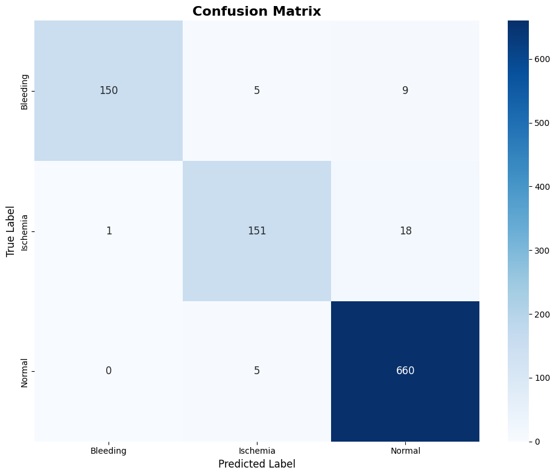

# Brain Stroke Classification and Segmentation

## Description

This project implements a hybrid deep learning architecture for automated categorization and lesion delineation of brain strokes in NCCT (Non-Contrast Computed Tomography) imagery. It combines classification and segmentation models to detect and delineate stroke lesions from CT scans.

The project uses:
- **ConvNeXt** model for stroke classification
- **U-Net with EfficientNet-B4 encoder** for lesion segmentation

## Dataset

The dataset is sourced from Kaggle: [Brain Stroke CT Dataset](https://www.kaggle.com/datasets/ozguraslank/brain-stroke-ct-dataset)

It includes CT images categorized for stroke detection and segmentation tasks.

## Requirements

- Python 3.x
- Jupyter Notebook
- Kaggle API (for dataset download)
- Required Python packages:
  - kaggle
  - timm
  - scikit-learn
  - tqdm
  - TensorFlow or PyTorch (depending on the implementation in the notebook)

Install dependencies:

```bash
pip install kaggle timm scikit-learn tqdm
```

Set up Kaggle API by placing your `kaggle.json` file in `~/.kaggle/` or as shown in the notebook.

## Usage

1. Clone or download this repository.
2. Open the Jupyter notebook: `Brain Stroke classification and segmentation_muralikante.ipynb`
3. Execute the cells sequentially:
   - Download and unzip the dataset
   - Preprocess and augment the data
   - Train the classification model (ConvNeXt)
   - Train the segmentation model (U-Net)
   - Evaluate and visualize results

## Results

### Classification Model Results

#### Confusion Matrix for Stroke Detection


#### Overall Confusion Matrix


#### Class-wise Accuracy


#### Multi-class ROC Curve (One-vs-Rest)


### Segmentation Model Results

#### Segmentation Results


### Real-world Validation

#### Validation with Real-world Images


## Abstract

For detailed abstract, refer to `Abstract.docx`.

## License

This project is licensed under the terms specified in the `LICENSE` file.
